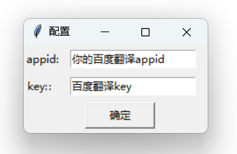
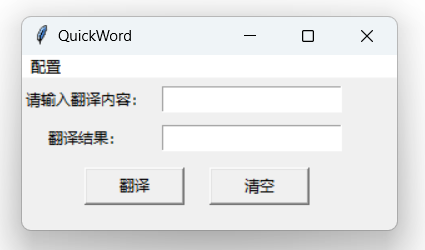

# QuickWord

一款实时翻译的桌面小工具

### 简介

一直找不到合适的桌面轻量翻译翻译工具，索性自己DIY一个

- 技术选型：

  - electron 太大   ------pass
  - C# 不会             ------pass
  - Java/JavaFX      ------pass

- 为什么使用Python？

  ......en

  只会基于浏览器的界面开发😂，查了一下桌面应用开发的技术，学习成本太高。

  考虑使用VB，但太久没写。

  最后用的Python，没怎么学过py，但好在有现成的工具包（面向百度编程）


### 安装

直接安装或解压使用：[安装包](https://#) | [解压包](https://#)

#### 源码安装
- 安装pyinstaller

  ```she
  pip install pyinstaller
  ```

 - 打包程序

   ```shell
   pyinstaller -w QuickWord.py
   ```

 - 打包详细教程可[参考](https://www.jianshu.com/p/48f6dea265eb)

   

### 使用

**配置百度翻译**

重启工具



**翻译**



**快速翻译**

`ctrl+c ` 复制要翻译的内容

`ctrl+b ` 快速翻译

